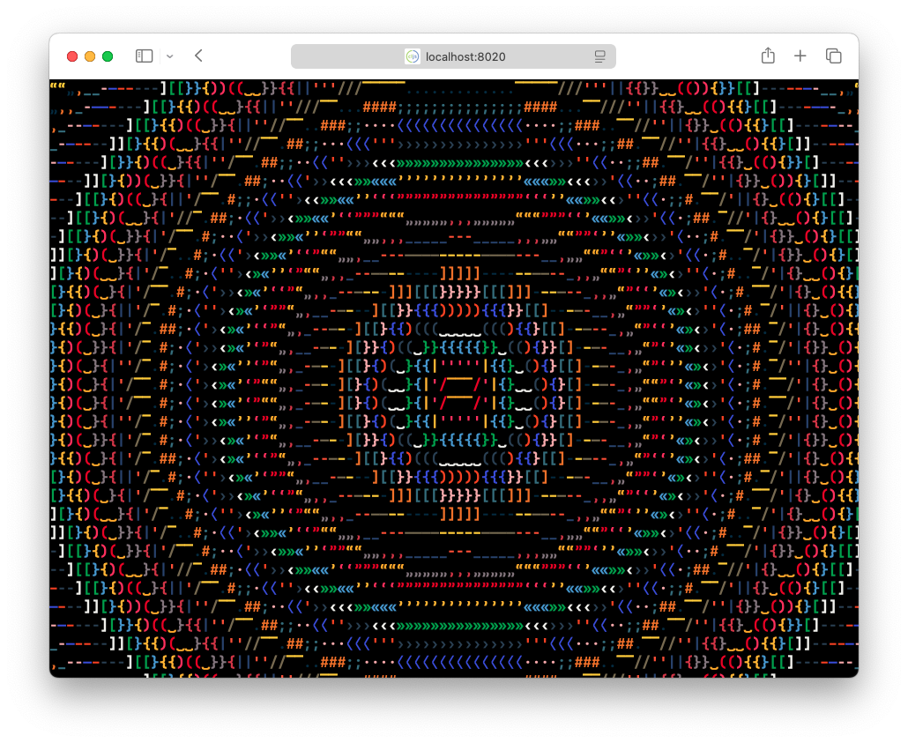

# cljs-ascii



An experimental framework for browser-based text art, inspired by GLSL fragment shaders.
The viewport is divided into a grid of cells displayed as `<span>` elements, each containing a single character.

Each sketch implements a draw function, which is called for each cell independently.
The function accepts the cell coordinates and returns a character, its color and a background color.
Additional information, for example the mouse or touch location and current time, is as well available to the draw function.

Example:
```clojure
(defn draw
  [{:keys [x y]}]
  (let [alphabet "0123456789"
        palette ["red" "green" "blue"]
        i (+ x y)]
    {:ch (nth alphabet (mod i (count alphabet)))
     :color (nth palette (mod i (count palette)))}))
```

